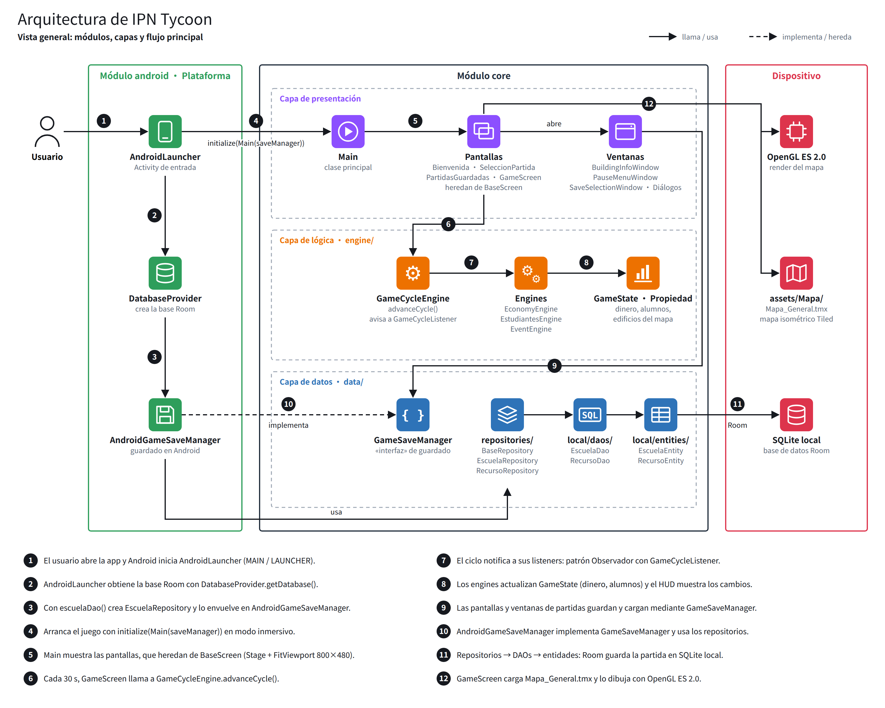
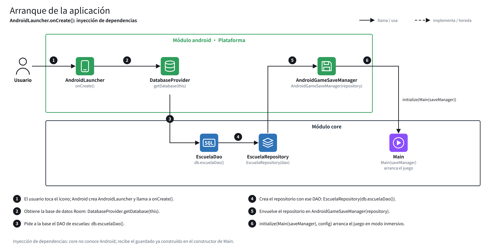
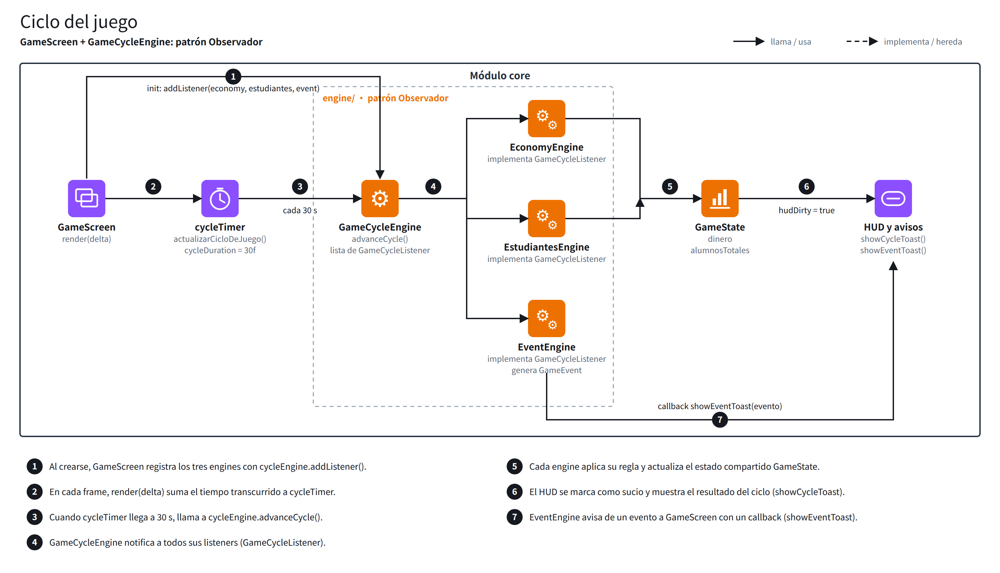
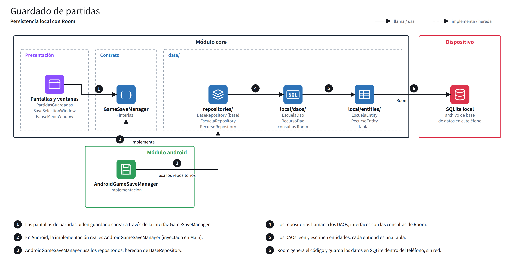

# IPN Tycoon (EDU_Tycoon)

IPN Tycoon es un juego de gestión estilo tycoon ambientado en el Instituto Politécnico Nacional (IPN). El jugador toma el rol de Director General y administra escuelas, presupuesto, docentes y reputación.

Este repositorio es un fork de [EmmanuelJuarez14/EDU_Tycoon](https://github.com/EmmanuelJuarez14/EDU_Tycoon).

## Tecnologías

- [libGDX](https://libgdx.com/) 1.14.0 (motor del juego), generado con [gdx-liftoff](https://github.com/libgdx/gdx-liftoff)
- Kotlin 2.2.10 con las extensiones [KTX](https://libktx.github.io/)
- AndroidX Room (base de datos SQLite local para las partidas guardadas)
- [Gradle](https://gradle.org/) con el Gradle Wrapper incluido

## Módulos

- `core`: lógica del juego compartida por todas las plataformas. Clase de entrada: `io.moviles.IPN_Tycoon.Main`.
- `android`: lanzador de Android (`AndroidLauncher`), manifiesto, recursos de Android y base de datos Room. Requiere el Android SDK.
- `assets`: recursos del juego, incluido el mapa isométrico de Tiled `Mapa/Mapa_General.tmx`, que se empaqueta en el APK.
- `docs`: documentación del proyecto.

## Arquitectura

El proyecto se divide en dos módulos de Gradle. `android` es la capa de plataforma: inicia la app, construye la base de datos Room e inyecta el sistema de guardado en el juego. `core` contiene el juego, organizado en tres capas: presentación (pantallas y ventanas), lógica (`engine/`) y datos (`data/`). Todo se ejecuta en el dispositivo; la app no usa la red.

### Vista general



### Arranque de la app

`AndroidLauncher.onCreate()` crea la base de datos, el repositorio y `AndroidGameSaveManager`, y se lo pasa a `Main`. Así `core` nunca depende de Android (inyección de dependencias).



### Ciclo del juego

Cada 30 segundos, `GameScreen` llama a `GameCycleEngine.advanceCycle()`. El ciclo notifica a sus listeners (`EconomyEngine`, `EstudiantesEngine`, `EventEngine`), que actualizan `GameState` (patrón Observador).



### Sistema de guardado

Las pantallas guardan y cargan mediante la interfaz `GameSaveManager`. En Android, `AndroidGameSaveManager` usa los repositorios, DAOs y entidades para guardar los datos en una base SQLite local con Room.



## Entorno probado

| Herramienta | Versión |
|---|---|
| Sistema operativo | Windows 11 Pro, 64 bits (x64) |
| Android Studio | Quail 3 2026.1.3 (Build #AI-261.26222.65.2613.15948027) |
| JDK de Gradle | JDK 21 (Gradle JVM criteria en Android Studio) |
| Distribución de Gradle | Gradle Wrapper (incluido en el repositorio) |
| Plataforma del Android SDK | API 35 (compileSdk / targetSdk) |
| Android Gradle Plugin | 8.9.3 |
| Kotlin | 2.2.10 |
| Dispositivo de prueba | Xiaomi 2511FPC34G (celular físico, depuración USB), Android 16 (API 36) |

## Ejecutar desde un clon limpio

### Requisitos previos

1. Instalar **Git**: https://git-scm.com/
2. Instalar **Android Studio** (una versión compatible con Android Gradle Plugin 8.9.3). Incluye un JDK, así que no hace falta instalar Java aparte. El proyecto requiere **JDK 17 o superior**.
3. En Android Studio, abrir **Tools > SDK Manager** e instalar **Android SDK Platform 35** (Android 15).

### Pasos

1. Clonar el repositorio:

   ```
   git clone https://github.com/JulioCesarCaballero/EDU_Tycoon.git
   ```

2. Abrir Android Studio, elegir **File > Open** y seleccionar la carpeta raíz `EDU_Tycoon` (no `android` ni `core`).
3. Esperar a que termine el **Gradle Sync**. La primera sincronización descarga todas las dependencias y puede tardar varios minutos. Android Studio crea `local.properties` con la ruta de tu SDK automáticamente.
4. Si la sincronización falla por el JDK, ir a **File > Settings > Build, Execution, Deployment > Build Tools > Gradle** y poner el JDK de Gradle en versión 17 o superior (el JetBrains Runtime incluido funciona).
5. Preparar un dispositivo:
    - **Emulador:** abrir **Device Manager**, crear un dispositivo virtual con API 21 o superior e iniciarlo.
    - **Celular físico:** seguir [Ejecutar en un celular físico](#ejecutar-en-un-celular-físico) y conectarlo por USB.
6. En el selector de configuración de ejecución (barra superior), elegir **`android`** y el dispositivo.
7. Presionar **Run ▶**. El juego se abre en modo horizontal.

### Alternativa por línea de comandos

Desde la raíz del repositorio (Windows):

```
gradlew.bat android:installDebug
gradlew.bat android:run
```

En macOS/Linux usar `./gradlew` en lugar de `gradlew.bat`. La tarea `run` necesita `local.properties` con `sdk.dir` o la variable de entorno `ANDROID_SDK_ROOT`, además de un dispositivo conectado o un emulador en ejecución.

Nota: `gradle.properties` pone el nivel de log de Gradle en `quiet`, así que la consola muestra muy poca información cuando la compilación sale bien.

### Ejecutar en un celular físico

Para instalar y ejecutar el juego en un celular Android físico, primero hay que activar estas opciones:

1. **Opciones de desarrollador:** ir a **Ajustes > Acerca del teléfono** y tocar siete veces **Número de compilación** (en Xiaomi: **Versión del SO**).
2. **Depuración USB:** en **Ajustes > Opciones de desarrollador**, activar **Depuración USB**.
3. **Autorizar la computadora:** conectar el celular por USB y aceptar el aviso **"¿Permitir la depuración USB?"** en el teléfono.
4. **Instalar vía USB (solo Xiaomi / HyperOS / MIUI):** en **Opciones de desarrollador**, activar **Instalar vía USB**. Sin esto, el teléfono bloquea la instalación desde Android Studio.

Después de esto, el celular aparece en el selector de dispositivos de Android Studio.

## Solución de problemas

No se encontraron errores ni complicaciones durante la primera ejecución del proyecto. El Gradle Sync y la compilación terminaron sin cambios en el código ni en la configuración.

| Problema | Causa | Solución |
|---|---|---|
| Ningún problema en la primera ejecución | No aplica | No aplica |

## Tareas útiles de Gradle

Se ejecutan con `gradlew.bat` (Windows) o `./gradlew` (macOS/Linux):

- `android:installDebug`: compila el APK de depuración y lo instala en el dispositivo conectado.
- `android:lint`: valida el proyecto de Android.
- `build`: compila el código y los archivos de todos los módulos.
- `clean`: borra las carpetas `build`, que guardan clases compiladas y archivos generados.
- `test`: ejecuta las pruebas unitarias (si las hay).
- `--offline`: usa las dependencias guardadas en caché.
- `--refresh-dependencies`: fuerza la validación de todas las dependencias.

La mayoría de las tareas se pueden limitar a un módulo con el prefijo `nombre:`. Por ejemplo, `core:clean` borra solo la carpeta `build` del módulo `core`.

## Archivos que no se versionan (.gitignore)

El archivo `.gitignore` evita subir al repositorio archivos que se generan solos o que son propios de cada computadora:

| Categoría | Ejemplos | Por qué no se versiona |
|---|---|---|
| Salidas de compilación | `.gradle/`, `build/`, `*.class` | Gradle las regenera en cada compilación. Subirlas llena el repositorio y causa conflictos. |
| Configuración local | `local.properties` | Guarda la ruta del Android SDK de cada computadora, que es distinta para cada integrante. Android Studio la crea al abrir el proyecto. |
| Archivos del IDE | `.idea/`, `*.iml` | Preferencias personales de Android Studio. |
| Librerías nativas | `android/libs/arm64-v8a/`, `x86/`, etc. | La tarea `copyAndroidNatives` las extrae de las dependencias en cada build. |
| Generados del proyecto | `assets/assets.txt`, `.kotlin/` | Los crean la tarea `generateAssetList` y el compilador de Kotlin. |
| Archivos del sistema | `.DS_Store`, `Thumbs.db` | Los genera el sistema operativo. |

Por eso, después de clonar, el primer Gradle Sync tarda unos minutos: descarga y regenera todo lo que no está en el repositorio.

## Licencia

Licencia MIT. Ver [`LICENSE`](LICENSE) y [`docs/licencias.md`](docs/licencias.md) para las dependencias de terceros y la procedencia de los recursos.
