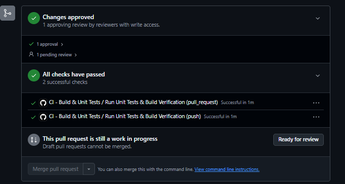
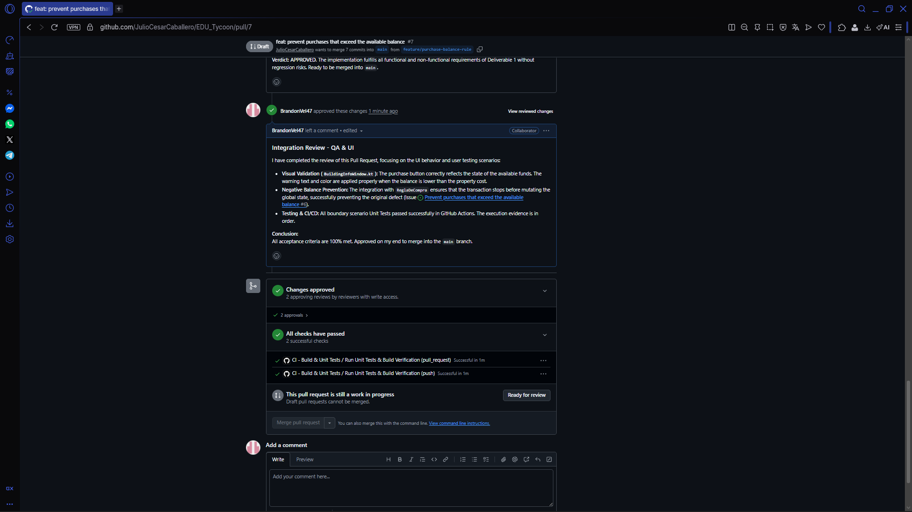
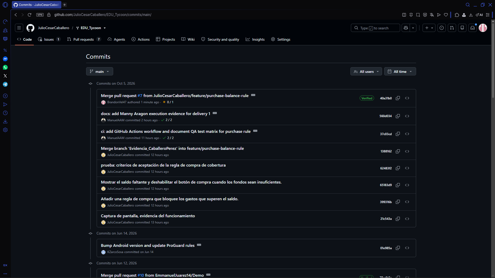

# Evidencias de la Parte 3 (Punto 3.9)

A continuación se presentan las evidencias requeridas para la culminación de la Parte 3 del proyecto.

* **Liga de la issue:** [Bug: Prevent purchases that exceed the available balance #6](https://github.com/JulioCesarCaballero/EDU_Tycoon/issues/6)
* **Liga del Pull Request:** [PR #7 - feat: prevent purchases that exceed the available balance](https://github.com/JulioCesarCaballero/EDU_Tycoon/pull/7)
* **Liga de la etiqueta parcial-1:** [Release Parcial 1 - EDU Tycoon](https://github.com/JulioCesarCaballero/EDU_Tycoon/releases/tag/parcial-1)

### Captura del resultado de la integración continua (CI/CD)

### Captura de la conversación de revisión

### Captura del historial de commits
