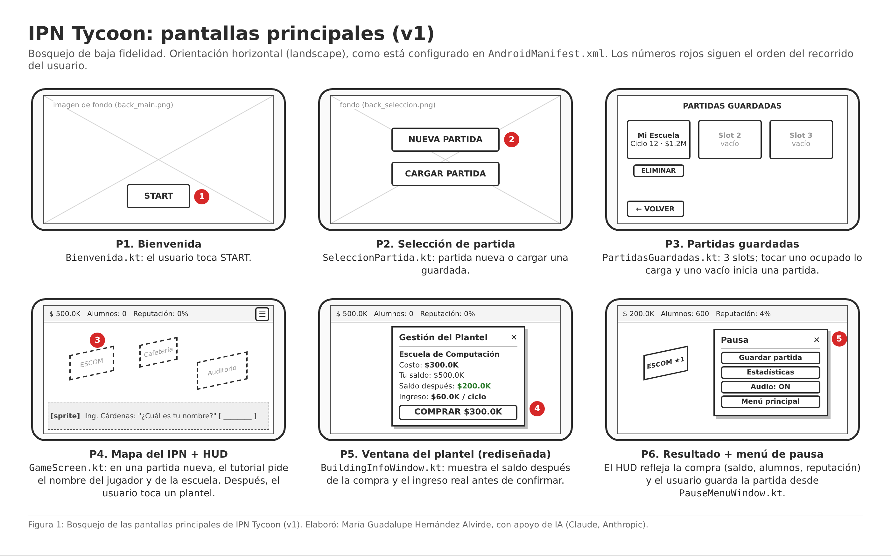
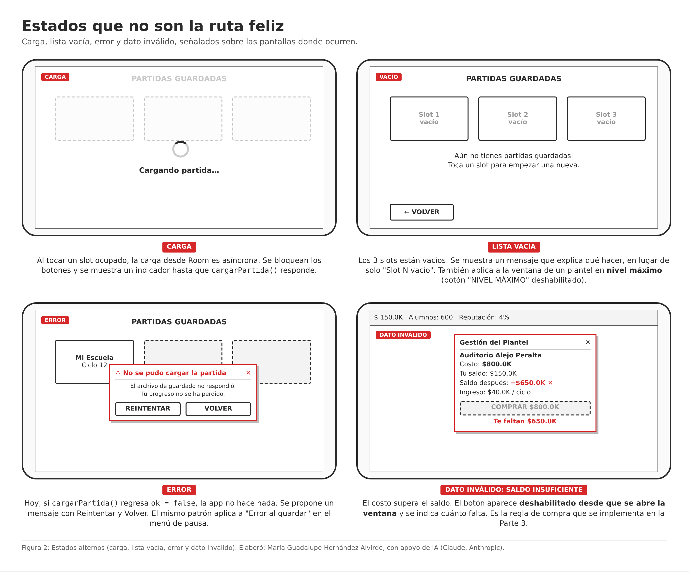
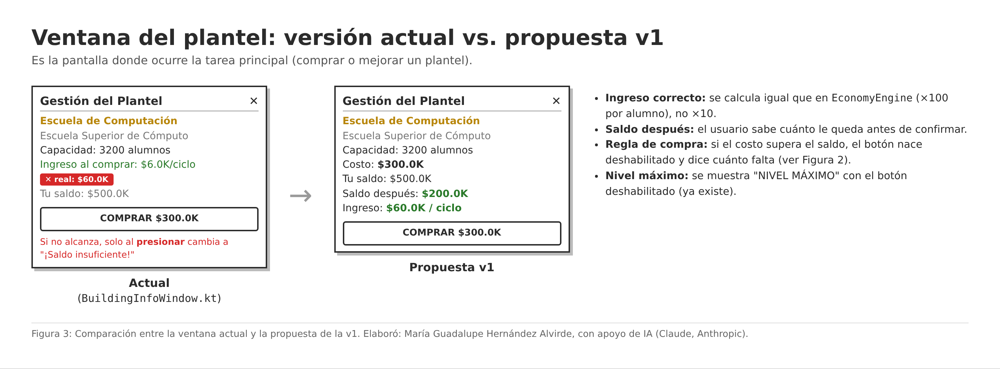
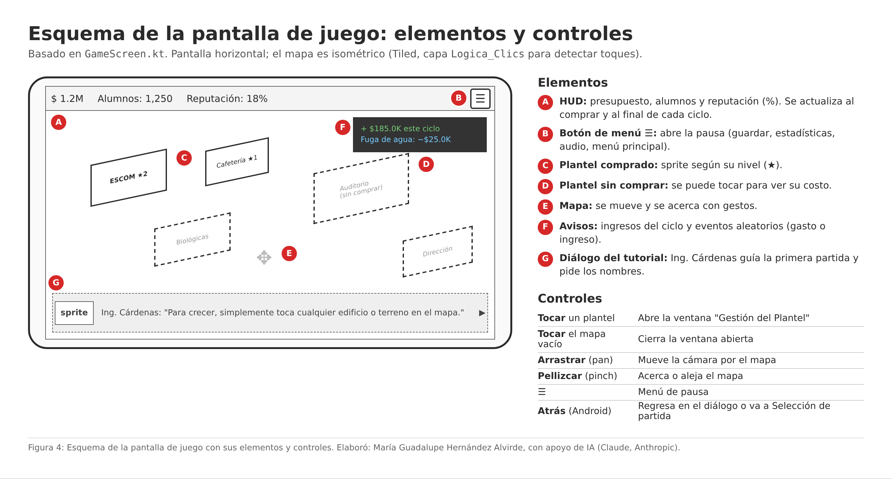
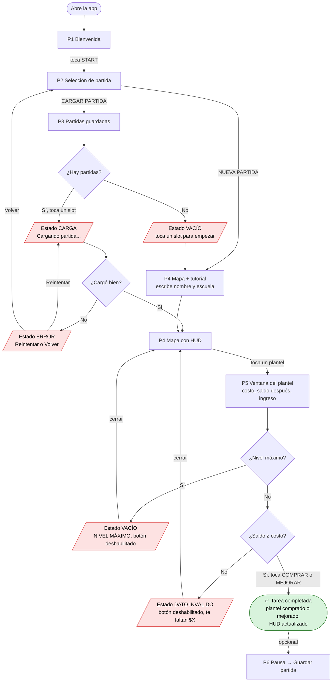
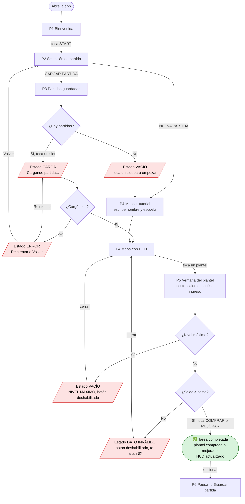

# Material visual de la idea (punto 1.2)

Bosquejos de baja fidelidad de **IPN Tycoon (ruta EduTycoon)** para la primera versión descrita en [`idea.md`](idea.md). La app se juega en **horizontal (landscape)**, como está configurado en `android/AndroidManifest.xml`.

> **Autoría y uso de IA:** todas las figuras las elaboró María Guadalupe Hernández Alvirde con apoyo de **Claude (Anthropic)**. Los bosquejos se generaron como HTML y se exportaron a PNG. El diagrama de recorrido se generó con Mermaid. El contenido se basa en el código real del repositorio.

---

## 1. Pantallas principales

*Figura 1. Bosquejo de las seis pantallas principales: Bienvenida, Selección de partida, Partidas guardadas, Mapa con HUD, Ventana del plantel (rediseñada) y Menú de pausa. Elaboró: María Guadalupe Hernández Alvirde, con apoyo de IA (Claude, Anthropic).*

| # | Pantalla | Archivo en el repositorio |
|---|---|---|
| P1 | Bienvenida | `core/.../Bienvenida.kt` |
| P2 | Selección de partida | `core/.../SeleccionPartida.kt` |
| P3 | Partidas guardadas | `core/.../PartidasGuardadas.kt` |
| P4 | Mapa del IPN + HUD | `core/.../GameScreen.kt` |
| P5 | Ventana del plantel | `core/.../BuildingInfoWindow.kt` |
| P6 | Menú de pausa | `core/.../PauseMenuWindow.kt` |

## 2. Estados que no son la ruta feliz

*Figura 2. Estados alternos señalados sobre las pantallas donde ocurren: carga, lista vacía, error y dato inválido (saldo insuficiente). Elaboró: María Guadalupe Hernández Alvirde, con apoyo de IA (Claude, Anthropic).*

| Estado | Dónde ocurre | Qué ve el usuario |
|---|---|---|
| **Carga** | P3, al tocar un slot ocupado | Botones bloqueados e indicador "Cargando partida…" |
| **Lista vacía** | P3 sin partidas guardadas; P5 con el plantel en nivel máximo | Mensaje que explica qué hacer; botón "NIVEL MÁXIMO" deshabilitado |
| **Error** | P3 si `cargarPartida()` falla; P6 si falla el guardado | Mensaje con las opciones Reintentar y Volver |
| **Dato inválido** | P5 cuando el costo supera el saldo | Botón deshabilitado desde que se abre la ventana y el texto "Te faltan $X" |

## 3. Ventana del plantel: actual vs. propuesta

*Figura 3. Comparación entre la ventana actual (`BuildingInfoWindow.kt`) y la propuesta de la v1: ingreso correcto, saldo después de la compra y regla de compra visible. Elaboró: María Guadalupe Hernández Alvirde, con apoyo de IA (Claude, Anthropic).*

## 4. Esquema de la pantalla de juego

*Figura 4. Esquema de la pantalla de juego: HUD, botón de menú, planteles comprados y sin comprar, mapa, avisos de ciclo y eventos, y diálogo del tutorial, con sus controles táctiles. Elaboró: María Guadalupe Hernández Alvirde, con apoyo de IA (Claude, Anthropic).*

| Control | Acción |
|---|---|
| Tocar un plantel | Abre "Gestión del Plantel" |
| Tocar el mapa vacío | Cierra la ventana abierta |
| Arrastrar (pan) | Mueve la cámara |
| Pellizcar (pinch) | Acerca o aleja el mapa (zoom) |
| Botón ☰ | Abre el menú de pausa |
| Botón Atrás de Android | Retrocede en el diálogo o regresa a Selección de partida |

## 5. Recorrido del usuario

Desde que abre la app hasta que completa la tarea principal: **comprar o mejorar un plantel**. Los nodos en rojo son estados alternos y el verde es la tarea completada.

*Figura 5. Diagrama del recorrido del usuario, desde que abre la app hasta que compra o mejora un plantel, incluidos los estados alternos. Elaboró: María Guadalupe Hernández Alvirde, con apoyo de IA (Claude, Anthropic), generado con Mermaid.*
