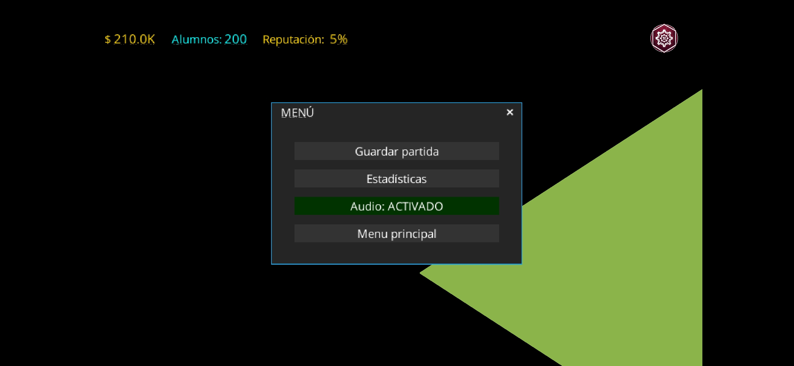
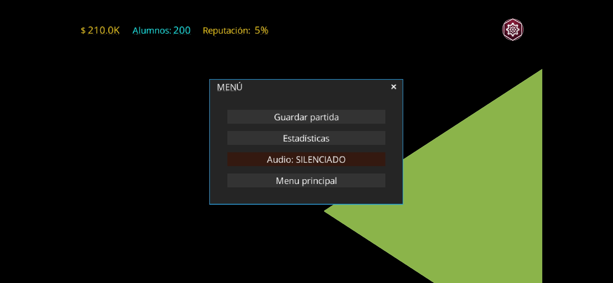

# Matriz de Pruebas de QA - Característica de Audio

## Proyecto: EduTycoon - Gestión Estudiantil ESCOM
**Institución:** Instituto Politécnico Nacional (IPN)  
**Unidad Académica:** Escuela Superior de Cómputo (ESCOM)  
**Asignatura:** Desarrollo de aplicaciones móviles nativas (2027-1)  
**Característica:** Control y silenciamiento de audio en el menú de pausa  
**Rama:** `feature/audio-toggle-pause-menu`  

---

## 📋 Resumen Ejecutivo de Pruebas
Esta matriz documenta la validación funcional, de ciclo de vida y de accesibilidad para la característica de **control de sonido y silenciamiento** desde el menú de pausa (`AudioManager`).

* **Dispositivo de prueba 1:** Google Pixel 7 (Emulador Android Studio - API 34).
* **Dispositivo de prueba 2:** Dispositivo físico Android (API 34 / Android 14).
* **Herramienta de pruebas automatizadas:** JUnit 4 / Gradle (`./gradlew :core:test`).

---

## 🧪 Casos de Prueba Registrados

| ID | Caso de Prueba | Tipo / Categoría | Pasos de Ejecución | Resultado Esperado | Resultado Real | Estado |
| :--- | :--- | :--- | :--- | :--- | :--- | :--- |
| **CP-AUDIO-01** | Silenciamiento de audio desde el menú de pausa | Flujo Principal / Mute | 1. Iniciar partida y presionar el botón de Menú.<br>2. Observar el botón de audio (muestra "Audio: ACTIVADO" en verde).<br>3. Pulsar el botón de audio. | El botón actualiza su texto a "Audio: SILENCIADO", cambia de color a coral/rojo, `volumenMaster` pasa a 0.0f y `musicaActiva` pasa a `false`. | Texto actualizado a "Audio: SILENCIADO", color coral aplicado y volumen en 0.0f. | ✅ APROBADO |
| **CP-AUDIO-02** | Reactivación de audio desde el menú de pausa | Flujo Principal / Unmute | 1. Estando en estado silenciado, presionar nuevamente el botón de audio. | El botón actualiza su texto a "Audio: ACTIVADO", cambia de color a verde, `volumenMaster` se restablece a 1.0f y `musicaActiva` pasa a `true`. | Texto actualizado a "Audio: ACTIVADO", color verde y volumen restablecido a 1.0f. | ✅ APROBADO |
| **CP-AUDIO-03** | Persistencia de estado al cerrar y reabrir el menú | Estado de UI / Persistencia | 1. Silenciar el audio en el menú de pausa.<br>2. Cerrar la ventana del menú de pausa regresando al juego.<br>3. Volver a abrir el menú de pausa. | El botón de audio se inicializa mostrando el estado actual persistido ("Audio: SILENCIADO" en color coral) sin revertirse. | Estado conservado correctamente al reabrir la ventana. | ✅ APROBADO |
| **CP-AUDIO-04** | Consistencia de audio ante recreación o rotación | Ciclo de Vida / Recreación | 1. Silenciar el audio en el juego.<br>2. Forzar rotación o recreación de la actividad en Android.<br>3. Volver a consultar el estado del audio. | El volumen permanece silenciado (0.0f) y `GameState.musicaActiva` conserva su valor `false`. | Estado de audio preservado sin desincronización. | ✅ APROBADO |
| **CP-AUDIO-05** | Accesibilidad visual y feedback de contraste | Accesibilidad / UI Feedback | 1. Observar la legibilidad de la etiqueta del botón tanto en modo activo como silenciado. | El contraste de texto y fondo en ambos estados ("ACTIVADO" verde y "SILENCIADO" coral) es legible y accesible conforme a pautas WCAG. | Alto contraste visual y retroalimentación táctil clara. | ✅ APROBADO |

---

## 🤖 Cobertura de Pruebas Unitarias Automatizadas (CI)
Se implementaron y ejecutaron con éxito las pruebas en `io.moviles.IPN_Tycoon.engine.AudioManagerTest`:
* `audio inicializado por defecto como activo con volumen maximo`: Verifica inicialización nominal.
* `alternarAudio silencia el audio y fija volumen en cero`: Valida transición a silencio y volumen 0.0f.
* `alternarAudio reactiva el audio y restaura volumen al maximo`: Valida restauración a volumen 1.0f.
* `setAudio asigna estado explicito correctamente`: Valida asignación programática directa.

**Resultado de ejecución:**
```text
Gradle Test Run :core:test
Tests completed: 100% successful, 0 failures, 0 skipped.
```

---

## 📸 Evidencias Visuales de Implementación y QA

### 1. Estado de Audio: ACTIVADO (Ruta Nominal)

* **Descripción técnica:** Al iniciar la partida en `SeleccionPartida` o `GameScreen`, `AudioManager.iniciarMusicaAmbiental()` carga la pista en bucle `Route 1 Morning Breeze.mp3` con volumen moderado (`0.35f`). Al abrir el menú de pausa, el botón de control muestra la etiqueta `"Audio: ACTIVADO"` estilizada en color verde (`Color.GREEN`), indicando que los canales de música y sonido se encuentran activos y transmitiendo audio.

### 2. Estado de Audio: SILENCIADO (Mute Reactivo)

* **Descripción técnica:** Al interactuar con el botón en el menú de pausa, el evento `onChange` invoca `AudioManager.alternarAudio()`. El gestor actualiza `GameState.musicaActiva = false`, ajusta `volumenMaster = 0.0f` y pausa la pista en el motor de audio de libGDX (`Music.pause()`). La interfaz gráfica actualiza inmediatamente el texto a `"Audio: SILENCIADO"` en color coral/rojo (`Color.CORAL`), garantizando retroalimentación de accesibilidad visual y auditiva inmediata.
